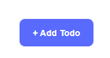
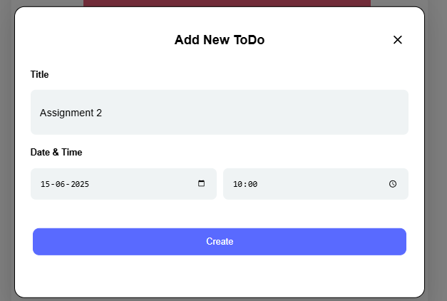
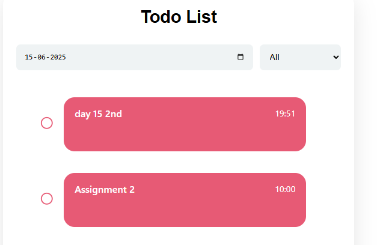
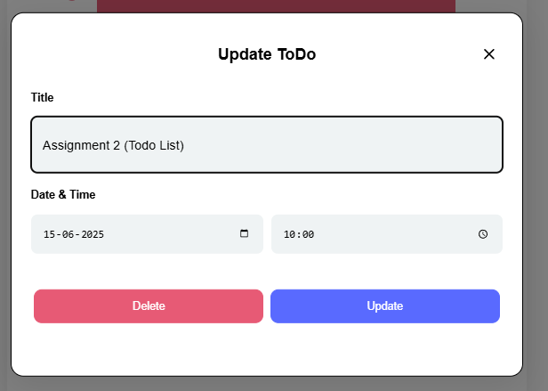
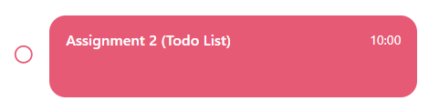
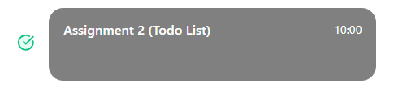
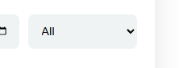
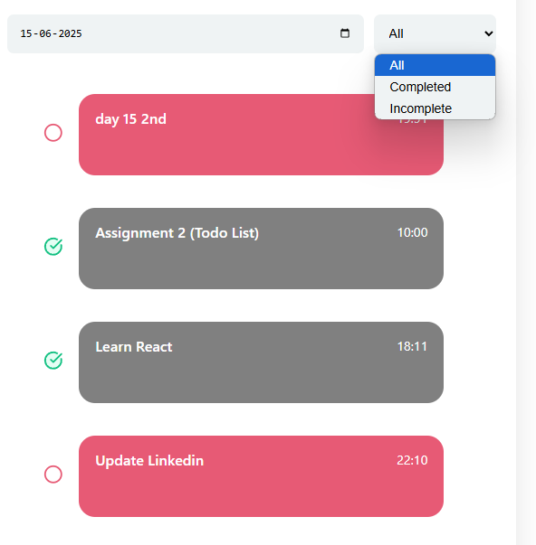
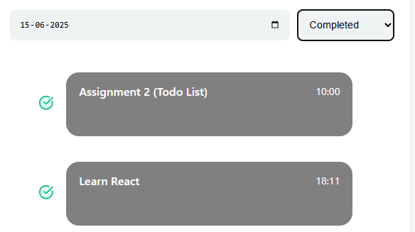

# Assignment 2 - Todo List

## ⚙️ Functionalities
- Add Todo
- Delete Todo
- Update Todo
- Manage Todo according to Date
- Filter & Sort Todos
- Add Specific Time for each Todo
- Save Todos in Local Storage
- Mark Complete & Incomplete 

## 📖 Guide 

### 1. Add Todo 
- Click on `Add Todo` button
 

- Fill in details 
 

- Click `create` button

### 2. Update/Delete Todo
- Click on the todo you want to Update/Delete
 

- Make Changes like text, time, date and click `Update`
 

- Click `Delete` to delete the todo

### 3. Mark Complete
- Click on the Empty Circle beside a todo to mark it as Complete
 

### 4. Filter/Sort Todos
- Click the drop down
 

- Select the option you want
 

 
